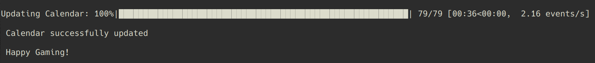
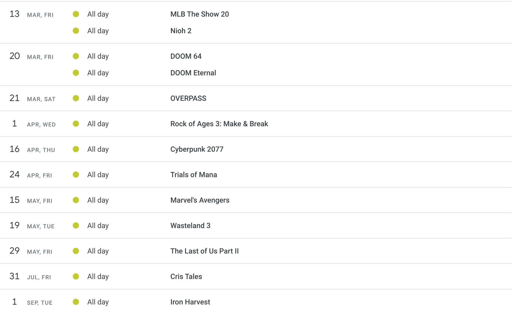

# ps4_release_calendar

## 1. Overview 
A web-scraping project which updatates your Goolge Calendar with release dates of upcoming PS4 games.

The main goal is to help PS4 gamers like myself who have no time or too lazy to go to websites like IGN to check upcoming PS4 releases.
<br>
<br>

**Script in action**



**Updated Calndar**


<br>
<br>
## 2. Uasge Instructions

### Goolge Calendar API
To access your Google calendar using Python you need to set up Google Calendar API. 
This [Youtube tutorial](https://www.youtube.com/watch?v=j1mh0or2CX8&list=PL4vwZmJNbv_Mr2jbVwOuLlqYdS1dyXWKs&index=15) by Indian Pythonista explains the process very well. (watch it until the initial setup.)

If you have wathched tutotorial, you should have required credentials saved as ```client_secrets.json```.
Place the file in the main project directory and in the ```pickle/``` folder.

<br>

### Installing Dependencies
All the packages/modules required can be found in ```requirements.txt```
To install, simply use pip:

```pip install -r /path/to/requirements.txt```

Packages installed in this project's environment are:
```
beautifulsoup4==4.8.1
cachetools==3.1.1
certifi==2019.9.11
chardet==3.0.4
google-api-python-client==1.7.11
google-auth==1.7.1
google-auth-httplib2==0.0.3
google-auth-oauthlib==0.4.1
httplib2==0.14.0
idna==2.8
mkl-fft==1.0.15
mkl-random==1.1.0
mkl-service==2.3.0
oauthlib==3.1.0
pyasn1==0.4.7
pyasn1-modules==0.2.7
python-dateutil==2.8.1
pytz==2019.3
requests==2.22.0
requests-oauthlib==1.3.0
rsa==4.0
six==1.13.0
soupsieve==1.9.3
tqdm==4.40.0
uritemplate==3.0.0
urllib3==1.25.7
```

<br>

### Running the Script

There are two ways to run the script: with or without pickle. 

***without pickle***

*every time you run any of the scripts, you will be prompted to login to your Google Account to authorize the app


First, run the ```check_calendar.py```, which prints out the name and id of each Google calendar you have (I recommend you create a new calendar just for the release dates so you can toggle it on/off), and take note of the id of calendar you want to use for the script. 

Alternatively, you can just log in to your Google calendar and click "configure" on the calendar you want to use, and then scroll down to find the id. 

Paste the id in the ```update_calendar``` function found at the bottom of ```main_scraper.py``` as the third argument, and run the ```main_scraper.py``` script.

<br>

***with pickle🥒***

*with pickle that stores you credentials, you will only be prompted once to log in to your Google account

First run the ```save_creds.py``` which will prompt you to log in and authorize the app, and then stores credentials as ```token.pkl```.

*please make sure the ```client_secrets.json``` file is saved in the pickle directory as well.*

Then run the ```check_calendar_pickle.py```, which prints out the name and id of each Google calendar you have, and take note of the id of calendar you want to use for the script. 

Paste the id in the ```update_calendar``` function found at the bottom of ```scraper_pickle.py``` as the third argument, and run the ```scraper_pickle.py``` script.
